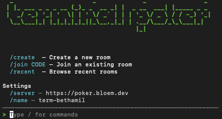

<p align="center">
  
</p>

<h1 align="center">Terminal Poker</h1>

<p align="center">
  Fast planning poker with a terminal edge.
  <br />
  Run estimation rounds without account friction.
</p>

<p align="center">
  Real-time rooms, optional Jira sync, room passcodes, and zero-account joins.
</p>

<p align="center">
  <code>React</code>
  <code>Vite</code>
  <code>Node</code>
  <code>Socket.IO</code>
  <code>PostgreSQL</code>
</p>

<p align="center">
  
</p>

<p align="center">
  Launch a room in seconds and run planning poker without the usual setup friction.
</p>

## Why Terminal Poker

- No accounts required. Join with a name and a room code.
- Real-time voting, reveal, reset, and optional room passcodes.
- Jira-friendly room setup and optional ticket sync.
- Resume recent rooms in the same browser.

## Getting Started

- Try it locally: [docs/development.md](docs/development.md)
- Self-host it: [docs/deployment.md](docs/deployment.md)
- Redis and cleanup behavior: [docs/operations.md](docs/operations.md)
- Full docs index: [docs/README.md](docs/README.md)

## CLI Client

Prefer the real terminal workflow? There is also a CLI client package: [`terminal-poker-cli`](https://www.npmjs.com/package/terminal-poker-cli).

<p align="center">
  
</p>

Install it globally:

```bash
npm install -g terminal-poker-cli
terminal-poker
```

The CLI connects to an existing Terminal Poker server. You can configure the server inside the CLI, or pass one explicitly with `--server` when needed.

## In Action

<table>
  <tr>
    <td width="50%">
      
      <br />
      Sync the current ticket, reveal the votes, and move straight into the next estimate.
    </td>
    <td width="50%">
      
      <br />
      Reveal the result instantly and keep the outcome clear, focused, and easy to discuss.
    </td>
  </tr>
</table>

## Run It Locally

Requirements:

- `pnpm`
- Docker

For the full local setup, environment variables, and common commands, see [docs/development.md](docs/development.md).

The shortest path is:

```bash
docker compose up -d postgres
pnpm install
cp apps/backend/.env.example apps/backend/.env
pnpm prisma:generate
pnpm db:migrate
pnpm dev
```

Open:

- Frontend: [http://localhost:5173](http://localhost:5173)
- Backend: [http://localhost:4000](http://localhost:4000)

## Deployment

Deployment guides now live under [docs/deployment.md](docs/deployment.md).

Release tags publish the container image to GHCR as `ghcr.io/bethamil/terminal_poker`.
